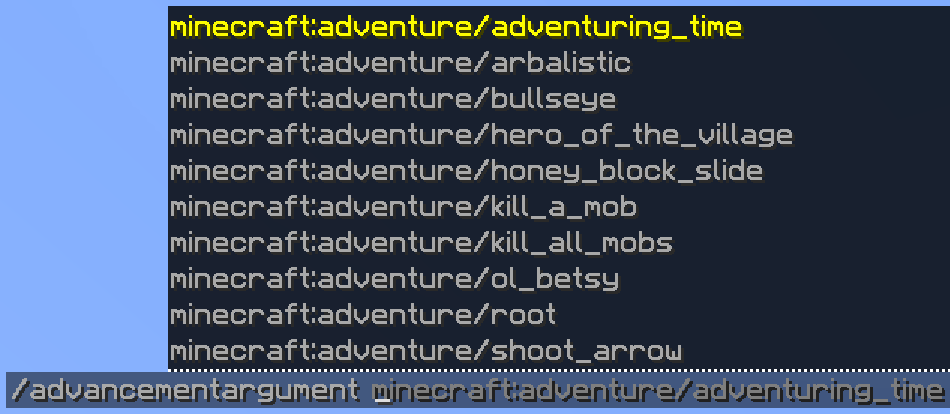

# Advancement arguments



The `AdvancementArgument` class represents in-game advancements. As expected, the `AdvancementArgument` can be casted to Bukkit's `Advancement` class.

<div class="example">

### Example - Awarding a player an advancement

Say we want to award a player an advancement. First, we need the syntax that our command will use:

```mccmd
/award <player> <advancement>
```

Since we require a player, we will use the `PlayerArgument` for this example. Given a player, we can simply get the `AdvancementProgress` for that player, and then award the criteria required to fully complete the provided advancement.

<div class="multi-pre">

```java,Java
{{#include ../../commandapi-documentation-code/src/main/dev/jorel/commandapi/examples/java/Examples.java:advancementarguments}}
```

```kotlin,Kotlin
{{#include ../../commandapi-documentation-code/src/main/dev/jorel/commandapi/examples/kotlin/Examples.kt:advancementarguments}}
```

</div>

</div>
