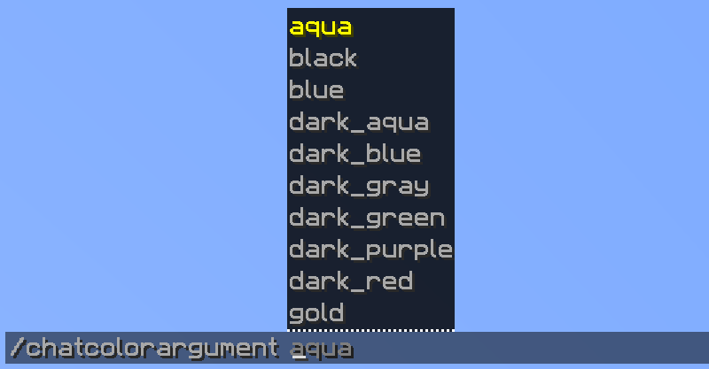

# Adventure chat arguments

> **Developer's Note:**
>
> The two following classes, `AdventureChatComponentArgument` and `AdventureChatArgument` depend on a Paper based server which has the Adventure library. If you use this class on a server without the Adventure library, it will throw a `PaperAdventureNotFoundException`

From Paper 1.16.5 build #473 onwards, Paper now includes [Kyori's Adventure API](https://github.com/KyoriPowered/adventure-platform). This library is a replacement of the BungeeCord chat API and has all of the same functionality as the BungeeCord chat API (and more!). The documentation for this API can be found [here](https://docs.adventure.kyori.net/index.html).

Since this functions very similar to the Spigot chat arguments, this page won't reiterate everything about how it works, we'll just outline some examples of how to use these arguments instead.

-----

## Adventure chat color argument



The `AdventureChatColorArgument` class is used to represent a given chat color (e.g. red or green). This argument returns the `NamedTextColor` object. If `reset` is passed to this argument, this will return `NamedTextColor.WHITE`.

<div class="example">

### Example - Username color changing plugin

Say we want to create a plugin to change the color of a player's username. We want to create a command of the following form:

```mccmd
/namecolor <chatcolor>
```

We then use the `ChatColorArgument` to change the player's name color:

<div class="multi-pre">

```java,Java
{{#include ../../commandapi-documentation-code/src/main/java/dev/jorel/commandapi/examples/java/Examples.java:argumentChatAdventure1}}
```

```kotlin,Kotlin
{{#include ../../commandapi-documentation-code/src/main/kotlin/dev/jorel/commandapi/examples/kotlin/Examples.kt:argumentChatAdventure1}}
```

```kotlin,Kotlin_DSL
{{#include ../../commandapi-documentation-code/src/main/kotlin/dev/jorel/commandapi/examples/kotlin/ExamplesKotlinDSL.kt:argumentChatAdventure1}}
```

</div>

</div>

-----

## Adventure chat component argument

The `AdventureChatComponentArgument` class accepts raw chat-based JSON as valid input, as declared [here](https://minecraft.gamepedia.com/Raw_JSON_text_format). This is converted into Adventure's `Component` class.

<div class="example">

### Example - Opening a book with raw JSON content

In this example, we'll create a simple command which lets you show a book to a user. The syntax for our command is as follows:

```mccmd
/showbook <target> <title> <author> <contents>
```

We can construct a book using the Adventure API's `Book.book(Component, Component, Component...)` method. In order to convert our strings into `Component` objects, we use the `Component.text(String)` method. Since Paper supports the Adventure API natively, we can then send this book to a player using the `openBook(Book)` method:

<div class="multi-pre">

```java,Java
{{#include ../../commandapi-documentation-code/src/main/java/dev/jorel/commandapi/examples/java/Examples.java:argumentChatAdventure2}}
```

```kotlin,Kotlin
{{#include ../../commandapi-documentation-code/src/main/kotlin/dev/jorel/commandapi/examples/kotlin/Examples.kt:argumentChatAdventure2}}
```

```kotlin,Kotlin_DSL
{{#include ../../commandapi-documentation-code/src/main/kotlin/dev/jorel/commandapi/examples/kotlin/ExamplesKotlinDSL.kt:argumentChatAdventure2}}
```

</div>

</div>

-----

## Adventure chat argument

The `AdventureChatArgument` class is the equivalent Adventure API class for the `ChatArgument` - it represents infinitely long strings similar to the `GreedyStringArgument` and allows entity selectors such as `@e`, `@p` and so on. The `AdventureChatArgument` returns a `Component`, similar to the `AdventureChatComponentArgument`.

<div class="example">

### Example - Sending personalized messages to players

We'll take the same example from the `ChatArgument` class, but using the `AdventureChatArgument` instead - We want to create a personalized message broadcasted to all users using a chat component that allows entity selectors. For this command, we want the following syntax:

```mccmd
/pbroadcast <message>
```

In order to broadcast an Adventure `Component` to all players on the server, we have to use Paper's `broadcast(Component, String)` method. This method requires a permission node which all players must have in order to receive the broadcasted message. By default, Bukkit-based servers (Spigot and Paper) use the `bukkit.broadcast.user` permission, which is described [here](https://bukkit.fandom.com/wiki/CraftBukkit_Commands#Additional_Permissions):

<div class="multi-pre">

```java,Java
{{#include ../../commandapi-documentation-code/src/main/java/dev/jorel/commandapi/examples/java/Examples.java:argumentChatAdventure3}}
```

```kotlin,Kotlin
{{#include ../../commandapi-documentation-code/src/main/kotlin/dev/jorel/commandapi/examples/kotlin/Examples.kt:argumentChatAdventure3}}
```

```kotlin,Kotlin_DSL
{{#include ../../commandapi-documentation-code/src/main/kotlin/dev/jorel/commandapi/examples/kotlin/ExamplesKotlinDSL.kt:argumentChatAdventure3}}
```

</div>

</div>
