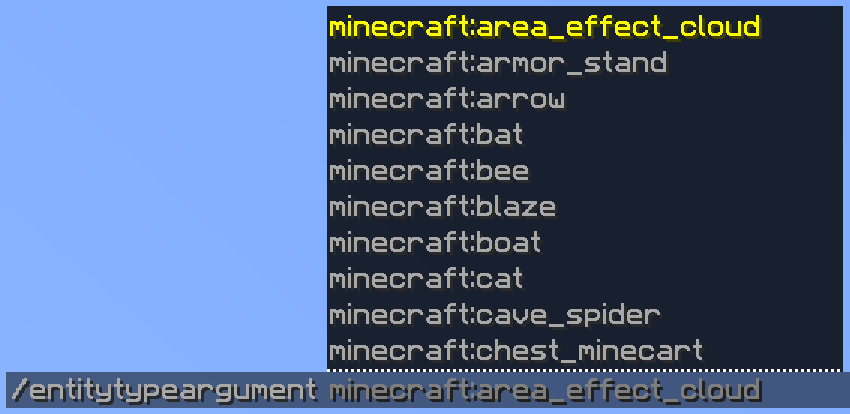

# Entity & player arguments

## Entity selector argument


Minecraft's [target selectors](https://minecraft.gamepedia.com/Commands#Target_selectors) (e.g. `@a` or `@e`) are implemented using the subclasses of the `EntitySelectorArgument` class. This allows you to select specific entities based on certain attributes.

There are four `EntitySelectorArgument` subclasses that determine what type of data to return:

- `EntitySelectorArgument.OneEntity` - A single entity, which returns a `Entity` object.
- `EntitySelectorArgument.ManyEntities`  - A collection of many entities, which returns a `Collection<Entity>` object.
- `EntitySelectorArgument.OnePlayer` - A single player, which returns a `Player` object.
- `EntitySelectorArgument.ManyPlayers` - A collection of players, which returns a `Collection<Player>` object.

The return type is the type to be cast when retrieved from the `Object[] args` in the command declaration.

<div class="example">

### Example - Remove entities command

Say we want a command to remove certain types of entities. Typically, this would be implemented using a simple command like:

```mccmd
/remove <player>
/remove <mob type>
/remove <radius>
```

Instead, we can combine all of these into one by using the `EntitySelectorArgument`. We want to be able to target multiple entities at a time, so we want to use the `EntitySelectorArgument.ManyEntities` constructor. We can simply retrieve the `Collection<Entity>` from this argument and iteratively remove each entity:

<div class="multi-pre">

```java,Java
{{#include ../../commandapi-documentation-code/src/main/java/dev/jorel/commandapi/examples/java/Examples.java:argumentEntities1}}
```

```kotlin,Kotlin
{{#include ../../commandapi-documentation-code/src/main/kotlin/dev/jorel/commandapi/examples/kotlin/Examples.kt:argumentEntities1}}
```

```kotlin,Kotlin_DSL
{{#include ../../commandapi-documentation-code/src/main/kotlin/dev/jorel/commandapi/examples/kotlin/ExamplesKotlinDSL.kt:entityselectorarguments}}
```

</div>

We could then use this to target specific entities, for example:

- To remove all cows:

  ```mccmd
  /remove @e[type=cow]
  ```

- To remove the 10 furthest pigs from the command sender:

  ```mccmd
  /remove @e[type=pig,limit=10,sort=furthest]
  ```

</div>

-----

## Player argument

The `PlayerArgument` class is very similar _(almost identical)_ to `EntitySelectorArgument.OnePlayer`. It returns a `Player` object and requires the player to be online.

> **Developer's Note:**
>
> The `PlayerArgument` internally uses the `GameProfile` class from Mojang's authlib, which means that this argument has a slight performance overhead compared to using `EntitySelectorArgument.OnePlayer`

-----

## OfflinePlayer argument

The `OfflinePlayerArgument` class is identical to the `PlayerArgument` class, but instead of returning a `Player` object, it returns an `OfflinePlayer` object. Internally, this argument makes calls to Mojang servers (via Mojang's authlib), meaning it can be slightly slower than alternative methods (such as using a `StringArgument` and suggesting a list of existing offline players).

The `OfflinePlayerArgument` _should_ be able to retrieve players that have never joined the server before.

-----

## Entity type argument



The `EntityTypeArgument` class is used to retrieve a type of entity as defined in the [`EntityType`](https://hub.spigotmc.org/javadocs/bukkit/org/bukkit/entity/EntityType.html) enum. In other words, this is an entity type, for example a pig or a zombie.

<div class="example">

### Example - Spawning entities

Say we want a command to spawn a specific type of entity, similar to the `/summon` command in Vanilla Minecraft, with the addition of specifying how many entities to spawn. We want to create a command of the following form:

```mccmd
/spawnmob <entity> <amount>
```

Since we're trying to specify an entity type, we will use the `EntityTypeArgument` as our argument type for `<entity>`. We combine this with the `IntegerArgument` class with a specified range of \\( 1 \le \textit{amount} \le 100 \\):

<div class="multi-pre">

```java,Java
{{#include ../../commandapi-documentation-code/src/main/java/dev/jorel/commandapi/examples/java/Examples.java:argumentEntities2}}
```

```kotlin,Kotlin
{{#include ../../commandapi-documentation-code/src/main/kotlin/dev/jorel/commandapi/examples/kotlin/Examples.kt:argumentEntities2}}
```

```kotlin,Kotlin_DSL
{{#include ../../commandapi-documentation-code/src/main/kotlin/dev/jorel/commandapi/examples/kotlin/ExamplesKotlinDSL.kt:entitytypearguments}}
```

</div>

Note how in this example above, we have to explicitly state `Player player, Object[] args`. This is due to a limitation of Java's type inference system which is discussed [here](./commandregistration.md#setting-the-commands-executor).

</div>
