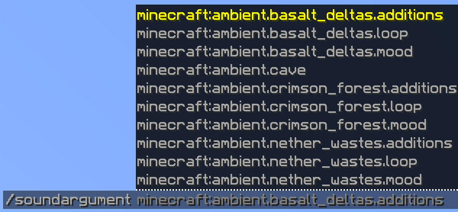

# Sound arguments



The `SoundArgument` class allows a command sender to retrieve the Bukkit `Sound` or `NamespacedKey` object to represent in-game sound effects (such as mob sounds or ambient sound effects), as well as in-game music.

The `SoundArgument` can return a `Sound` or `NamespacedKey` object. To return a `Sound` object, simply use the `SoundArgument` as normal. To return a `NamespacedKey` object, use the `SoundArgument.NamespacedKey` constructor instead:

```java
// Makes a SoundArgument that returns a Sound
new SoundArgument("sound");

// Makes a SoundArgument that returns a NamespacedKey
new SoundArgument.NamespacedKey("sound");
```

<div class="example">

### Example - Playing sound to yourself

Say we want a simple command that plays a specific sound at your location. To do this, we will make the following command:

```mccmd
/sound <sound>
```

This command simply plays the provided sound to the current player:

<div class="multi-pre">

```java,Java_(Sound)
{{#include ../../commandapi-documentation-code/src/main/java/dev/jorel/commandapi/examples/java/Examples.java:argumentSound1}}
```

```java,Java_(NamespacedKey)
{{#include ../../commandapi-documentation-code/src/main/java/dev/jorel/commandapi/examples/java/Examples.java:argumentSound2}}
```

```kotlin,Kotlin_(Sound)
{{#include ../../commandapi-documentation-code/src/main/kotlin/dev/jorel/commandapi/examples/kotlin/Examples.kt:soundarguments}}
```

```kotlin,Kotlin_(NamespacedKey)
{{#include ../../commandapi-documentation-code/src/main/kotlin/dev/jorel/commandapi/examples/kotlin/Examples.kt:soundarguments2}}
```

```kotlin,Kotlin_DSL_(Sound)
{{#include ../../commandapi-documentation-code/src/main/kotlin/dev/jorel/commandapi/examples/kotlin/ExamplesKotlinDSL.kt:soundarguments}}
```

```kotlin,Kotlin_DSL_(NamespacedKey)
{{#include ../../commandapi-documentation-code/src/main/kotlin/dev/jorel/commandapi/examples/kotlin/ExamplesKotlinDSL.kt:soundarguments2}}
```

</div>

</div>
