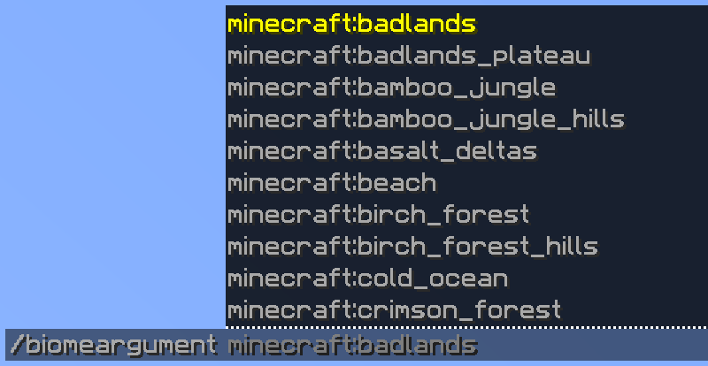

# Biome arguments



In Minecraft 1.16, they added the ability to refer to in-game biomes. The CommandAPI implements this using the `BiomeArgument`. As expected, this returns Bukkit's `Biome` enum when used.

<div class="example">

### Example - Setting the biome of a chunk

Say you want to set the biome of the current chunk that a player is in. We can do this using the `World.setBiome(x, y, z, biome)` method for a given world. We will use this command syntax to set the biome of our current chunk:

```mccmd
/setbiome <biome>
```

And we can set the biome of the current chunk as expected:

<div class="multi-pre">

```java,Java
{{#include ../../commandapi-documentation-code/src/main/dev/jorel/commandapi/examples/java/Examples.java:biomearguments}}
```

```kotlin,Kotlin
{{#include ../../commandapi-documentation-code/src/main/dev/jorel/commandapi/examples/kotlin/Examples.kt:biomearguments}}
```

</div>

</div>
