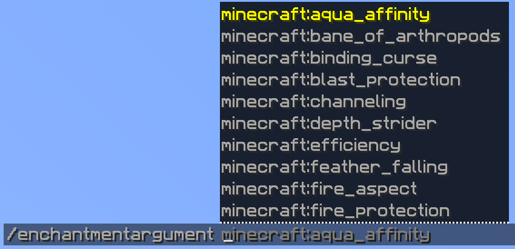

# Enchantment argument



The `EnchantmentArgument` class lets users input a specific enchantment. As you would expect, the cast type is Bukkit's `Enchantment` class.

<div class="example">

### Example - Giving a player an enchantment on their current item

Say we want to give a player an enchantment on the item that the player is currently holding. We will use the following command structure:

```
/enchantitem <enchantment> <level>
```

Since most enchantment levels range between 1 and 5, we will also make use of the `IntegerArgument` to restrict the level of the enchantment by usng its range constructor.

```java
LinkedHashMap<String, Argument> arguments = new LinkedHashMap<>();
arguments.put("enchantment", new EnchantmentArgument());
arguments.put("level", new IntegerArgument(1, 5));

new CommandAPICommand("enchantitem")
    .withArguments(arguments)
    .executesPlayer((player, args) -> {
		Enchantment enchantment = (Enchantment) args[0];
		int level = (int) args[1];
		
		//Add the enchantment
		player.getInventory().getItemInMainHand().addEnchantment(enchantment, level);
    })
    .register();
```

</div>

