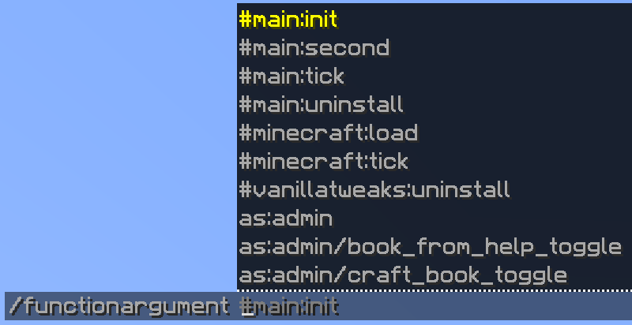

# Function arguments



The `FunctionArgument` class is used to represent a function or a tag in Minecraft. When retrieving an instance of the argument, it will return a `FunctionWrapper[]`, where each `FunctionWrapper` consists of a Minecraft function.

Therefore, if a user supplies a single function, the `FunctionWrapper[]` will be of size 1, and if the user supplies a tag which can consist of multiple functions, the `FunctionWrapper[]` will consist of the array of functions as declared by that tag.

<div class="example">

### Example - Minecraft's /function command

Since it's a little difficult to demonstrate a custom use for the `FunctionArgument`, we will show how you can implement Vanilla Minecraft's `/function` command. In this example, we want a command that uses the following structure:

```
/runfunction <function>
```

When provided with a function, it will execute that function. If instead a tag is provided, it will execute that tag (i.e. execute all functions declared in that tag).

```java
LinkedHashMap<String, Argument> arguments = new LinkedHashMap<>();
arguments.put("function", new FunctionArgument());

new CommandAPICommand("runfunction")
    .withArguments(arguments)
    .executes((sender, args) -> {
        FunctionWrapper[] functions = (FunctionWrapper[]) args[0];

        //Run all functions in our FunctionWrapper[]
        for(FunctionWrapper function : functions) {
            function.run();
        }
    })
    .register();
```

</div>