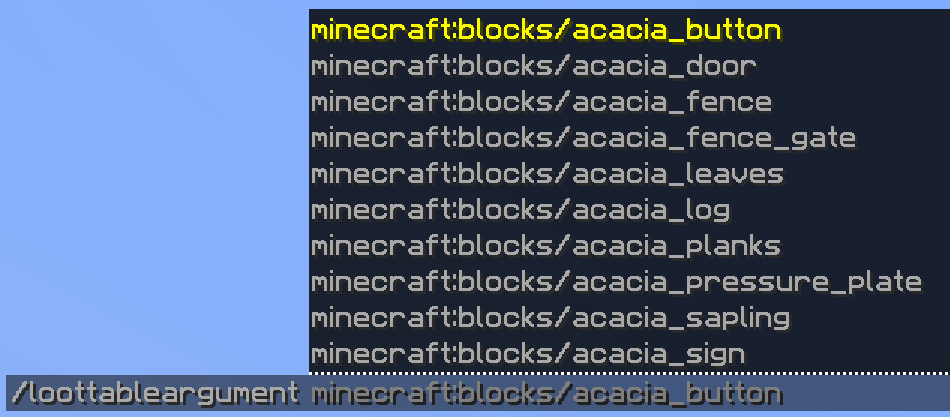

# LootTable argument



The `LootTableArgument` class can be used to get a Bukkit `LootTable` object.

<div class="example">

### Example - Filling an inventory with loot table contents

```java
LinkedHashMap<String, Argument> arguments = new LinkedHashMap<>();
arguments.put("loottable", new LootTableArgument());

new CommandAPICommand("giveloottable")
    .withArguments(arguments)
    .executesPlayer((player, args) -> {
        LootTable lootTable = (LootTable) args[0];
    
    	LootContext context = /* Some generated LootContext relating to the lootTable*/
		lootTable.fillInventory(player.getInventory(), new Random(), context);
    })
    .register();
```

> **Developer's Note:**
>
> Honestly, I've not managed to get a successful example of using a `LootTable` in practice, due to being unable to generate a suitable `LootContext`. If you believe you can supply a suitable example for this page, feel free to send an example [on the CommandAPI issues page](https://github.com/JorelAli/CommandAPI/issues/new/choose).

</div>