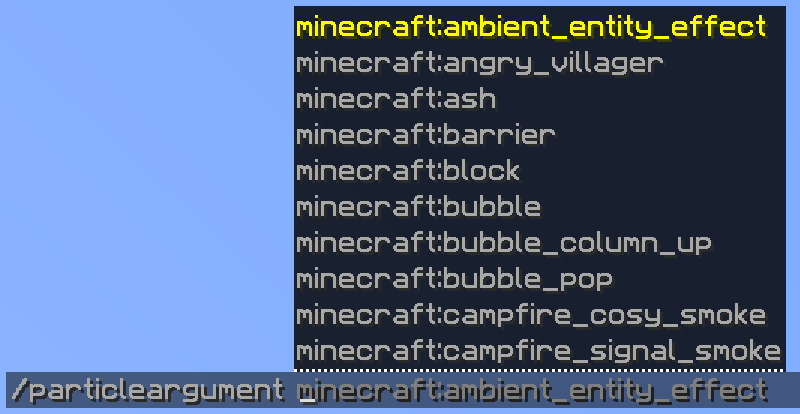

# Particle arguments



The `ParticleArgument` class represents Minecraft particles. As expected, this is casted to the Bukkit `Particle` class.

<div class="example">

### Example - Show particles at a player's location

Say we wanted to have a command that displayed particles at a player's location. We will use the following command structure:

```
/showparticle <particle>
```

With this, we can simply spawn the particle using the `World.spawnParticle(Particle, Location, int)` method:

```java
LinkedHashMap<String, Argument> arguments = new LinkedHashMap<>();
arguments.put("particle", new ParticleArgument());

new CommandAPICommand("showparticle")
    .withArguments(arguments)
    .executesPlayer((player, args) -> {
        player.getWorld().spawnParticle((Particle) args[0], player.getLocation(), 1);
    })
    .register();
```

</div>