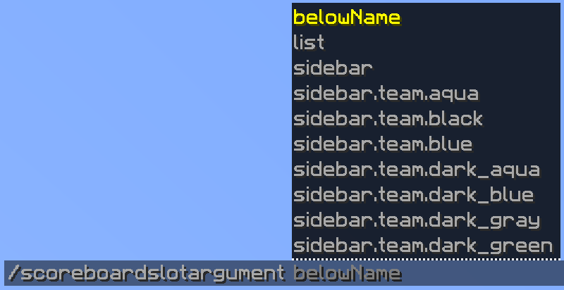

# Scoreboard arguments

The CommandAPI uses two classes to provide information about a scoreboard:

- The `ScoreHolderArgument` class represents **score holder** - a player's name or an entity's UUID that has scores in an objective. This is described in more detail [on the Minecraft Wiki](https://minecraft.gamepedia.com/Scoreboard#Objectives).
- The `ScoreboardSlotArgument` class represents a **display slot** (sidebar, list or belowName) as well as the team color if the display is the sidebar. This is described in more detail [on the Minecraft Wiki](https://minecraft.gamepedia.com/Scoreboard#Display_slots).

-----

## Score holder argument

The score holder argument can accept either a single entity or a collection of multiple entities. In order to specify which one to use, you must provide a `ScoreHolderType` enum value to the `ScoreHolderArgument` constructor, which is either `ScoreHolderType.SINGLE` or `ScoreHolderType.MULTIPLE`:

```java
new ScoreHolderArgument(ScoreHolderType.SINGLE);
new ScoreHolderArgument(ScoreHolderType.MULTIPLE);
```

Depending on which constructor is used, the cast type changes. If you use a `ScoreHolderType.SINGLE`, the argument must be casted to a `String`. Otherwise, if you use `ScoreHolderType.MULTIPLE`, the argument must be casted to a `Collection<String>`.

<div class="example">

### Example - Rewarding players with scoreboard objectives

Say we want to reward all players that fit a certain criteria. We want a command with the following structure:

```
/reward <players>
```

Since we could have multiple players that fit a certain criterion, we want to use `ScoreHolderType.MULTIPLE` as the parameter for the argument's constructor.

To give this example a bit more context, let's say we want to reward all players that have died less than 10 times in the server. To do this, we will use the following command:

```
/reward @e[type=player,scores={deaths=..9}]
```

Note how we use `..9` to represent 9 or less deaths (since ranges are inclusive). Also note how we restrict our input to players via the command using `type=player`. We can now implement our command:

```java
{{#include Examples.java:scoreholderargument}}
```

</div>

> **Developer's Note:**
>
> In the example above, we have our user use the `@e[type=player]` entity selector to restrict the `Collection<String>` so it only returns player names, which allows us to use `Bukkit.getPlayer(playerName)`. In practice, we cannot guarantee that such a selector will be used, so we could update the code to accept both entities and players. For example, we can differentiate between players and entities by using the `UUID.fromString(String)` method:
>
> ```java
> Collection<String> entitiesAndPlayers = (Collection<String>) args[0];
> for(String str : entitiesAndPlayers) {
>     try {
>         UUID uuid = UUID.fromString(str);
>         //Is a UUID, so it must by an entity
>         Bukkit.getEntity(uuid);
>     } catch(IllegalArgumentException exception) {
>         //Not a UUID, so it must be a player name
>         Bukkit.getPlayer(str); 
>     }
> }
> ```

-----

## Scoreboard slot argument



The `ScoreboardSlotArgument` represents where scoreboard information is displayed. Since the Bukkit scoreboard `DisplaySlot` is not able to represent the case where team colors are provided, the CommandAPI uses the `ScoreboardSlot` wrapper class as the representation of the `ScoreboardSlotArgument`.

### `ScoreboardSlot` wrapper

The `ScoreboardSlot` wrapper class has 3 methods:

```java
class ScoreboardSlot {
    public DisplaySlot getDisplaySlot();
    public ChatColor getTeamColor();
    public boolean hasTeamColor();
}
```

The `getDisplaySlot()` method returns the display slot that was chosen. If the display slot is `DisplaySlot.SIDEBAR` and `hasTeamColor()` returns true, then it is possible to use `getTeamColor()` to get the team color provided.

<div class="example">

### Example - Clearing objectives in a scoreboard slot

Say we want to clear all objectives in a specific scoreboard slot. In this example, we will use the main server scoreboard, which is accessed using `Bukkit.getScoreboardManager.getMainScoreboard()`. We want a command with the following structure:

```
/clearobjectives <slot>
```

We implement this simply by using the `ScoreboardSlotArgument` as our argument, and then we can clear the slot using the scoreboard `clearSlot(DisplaySlot)` method.

```java
{{#include Examples.java:scoreboardslotargument}}
```

</div>